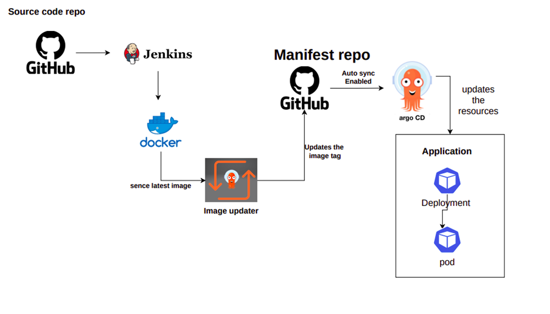

# CI/CD GitOps Projet with EKS, Jenkins and ArgoCD.

This project builds a complete Amazon EKS cluster with Terraform the CI will be handled by Jenkins and CD will be handled by ArgoCD.



## Stack I'll be using

- [x] **Terraform**
- [x] **EKS**
- [x] **Jenkins**
- [x] **Helm**
- [x] **ArgoCD**

## Pre-requisities

- [x] **AWS CLI**
- [x] **Terraform**
- [x] **Helm**

## Usage

Firstly you need to make sure you're logged in your AWS account with:

```bash
$ aws configure
```

After you've set the aws credentials in the aws-cli, proceed to Terraform:

```bash
$ git clone https://github.com/deanosaurx/project-int.git
$ cd infra
```

You should see these files:

```bash
$ tree
.
├── 0-provider.tf
├── 1-vpc.tf
├── 2-igw.tf
├── 3-subnets.tf
├── 4-nat.tf
├── 5-routes.tf
├── 6-eks.tf
└── 7-nodes.tf
```

Run Terraform:

```bash
$ terraform init
$ terraform apply
```

Click yes to begin provisioning

## Walkthrough

When the terraform deployment is complete, make sure you can reach the EKS cluster with:

```bash
$ aws eks --region eu-west-1 update-kubeconfig --name demo
#This command is based on my tf files, If you changed the cluster name and region in the tf files, make sure to update this command
```

Test it with a simple kubectl command:

```bash
$ kubectl get svc
```

Example output:

```bash
$ NAME         TYPE        CLUSTER-IP   EXTERNAL-IP   PORT(S)   AGE
 kubernetes   ClusterIP   172.20.0.1   <none>        443/TCP   107m
```

cd to charts/helm-mernapp and install the helm chart

```bash
$ helm install .
```

After installing the app helm chart, install the ingress controller

```bash
$ helm install nginx-ingress nginx-stable/nginx-ingress --set rbac.create=true --namespace todo-app
```

If everything went correctly, you should see an ingress controller loadbalancer service:

```bash
$ kubectl get svc -n todo-app
```

Example output

```bash
$ NAME                        TYPE          CLUSTER-IP   EXTERNAL-IP                                      PORT(S)
 nginx-ingress-controller     LoadBalancer  172.20....   <lb name in aws>.eu-west-1.elb.amazonaws.com      80, 443
```

Verify that the ingress we created with the yaml manifest (7-ingress.yaml) is attached to the ingress controller

```bash
$ kubectl get ingress -n todo-app
```

Example output

```bash
$ NAME      CLASS   HOSTS                ADDRESSP                                      PORT(S)
  ingress   <none>  cicd.deanosaur.com  <lb name in aws>.eu-west-1.elb.amazonaws.com    80
```

App should be installed and exposed to the world


- Note: If the attachment is successful, you will see that the host we provided in the ingress yaml file is mapped to the nginx-ingress-contoller svc

Install ArgoCD

```bash
$ kubectl create namespace argocd
$ kubectl apply -n argocd -f https://raw.githubusercontent.com/argoproj/argo-cd/stable/manifests/install.yaml
```

If you want to expose ArgoCD with external IP so you can access the API from the internet:

```bash
$ kubectl patch svc argocd-server -n argocd -p '{"spec": {"type": "LoadBalancer"}}'
```

If you don't want to expose ArgoCD to the outside world, you can use port-forwarding

```bash
$ kubectl port-forward svc/argocd-server -n argocd 8080:443
```

You should be able to access ArgoCD through your localhost on http://localhost:8080

After syncing your app in ArgoCD, you should be able to see the app overview:


