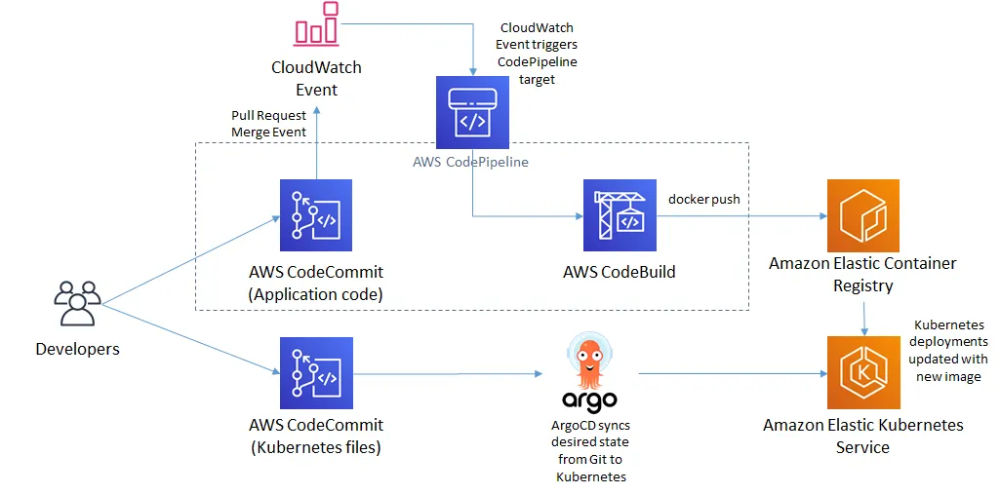

# CI/CD GitOps Projet with EKS, Jenkins and ArgoCD.

This project builds a complete Amazon EKS cluster with Terraform the CI will be handled by Jenkins and CD will be handled by ArgoCD.



## Stack I'll be using

- [x] **EKS**
- [x] **ECR**
- [x] **CodeCommit**
- [x] **CloudWatch**
- [x] **CodePipeline**
- [x] **CodeBuilt**
- [x] **ArgoCD**

## Pre-requisities

- [x] **AWS Account**
- [x] **AWS CLI**
- [x] **Helm CLI**

## Usage

Firstly you need to make sure you're logged in your AWS account with:

```bash
$ aws configure
```

Now create ECR repos, example command:

```bash
$ aws ecr create-repository \
    --repository-name sample-repo \
    --image-tag-mutability IMMUTABLE
```
